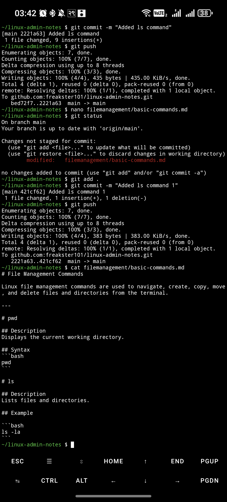

# File Management Commands

Linux file management commands are used to navigate, create, copy, move, and delete files and directories from the terminal.

---

# pwd

## Description
Displays the current working directory.

## Syntax
```bash
pwd
```

# ls

## Description
Lists files and directories.

## Example

```bash
ls -la
```



